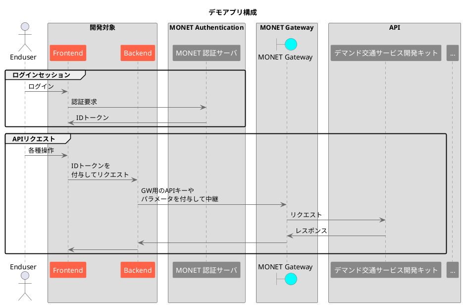

# store-tutorial-eventdrt

こちらはMONETマーケットプレイスを利用したデモアプリ「イベント×マルチモーダル」の公開リポジトリです。

デモアプリの構成は以下の通りです(PlantUMLを利用しています)。

バックエンドはPythonで実装し、フロントエンドはVue 2.0(typescript)で実装しています。
詳細はそれぞれのディレクトリを参照してください。
